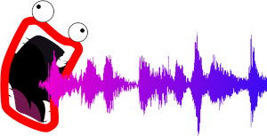

# ShoopDaLoop

ShoopDaLoop is a live looping application for Linux with a few DAW-like features.

The main intended use is for quickly expressing complex musical ideas without needing to record full end-to-end tracks for a whole song. It makes for a fun way to jam by oneself. Live performance could also be a good use-case, although it is not quite battle-tested enough to recommend that.

- **Fast**: ShoopDaLoop offers recording/playback of a large amount of loops efficiently.
- **Tracks**: Loops are organized into tracks, which share input/output JACK ports. Typical use-case is one instrument per track. Effects/synthesis are also shared per track.
- **MIDI and audio**: Loop MIDI and audio in the same application, possibly with synthesis in-between.
- **FX and synthesis**: ShoopDaLoop loops and tracks can optionally be "Dry + Wet", similar to [Luppp](http://openavproductions.com/luppp/). If used, the loop will record audio+midi dry as it comes in, feed it through internal or external effects/synthesizers and simultaneously also record the wet signal coming out. This feature has some advantages:

   - **Live effects/synthesis**: The dry signal can be set to playback while the wet side just passes through the signal out of synth/fx. This way, you can adjust your synth/fx on-the-fly and listen to the results without re-recording.
   - **Re-record**: The wet signal can be re-recorded while the dry signal is played back, consolidating the changes you made to synth/fx.
   - **CPU efficiency**: While playing back the recorded wet signal, synths and fx can be disabled so that they don't eat CPU.
   - **Internal/External**: The FX/synthesis for a track can be hosted internally. For this, ShoopDaLoop acts as a limited plugin host which can only start Carla as a plugin. Via Carla it is possible to host just about any audio plugin that exists. Alternatively, an external (JACK) send/return port can be used to hook up external JACK apps for synthesis/effects.

- **Scenes**: Similar to other clip-based applications, there are so-called "Scenes" which select a subset of all loops to be played together. Changing from one scene to another can be used to achieve an impactful musical transition. However, unlike some other tools, ShoopDaLoop's scenes are not bound to any particular row in the grid. A scene consists of an arbitrary selection of one loop (or none) per track, giving more flexibility.
- **Synchronization**: The intended use of ShoopDaLoop's loops is to synchronize all of them to the master loop. Loops will (re-)start playback when the master loop does. Loops can be multiples of the master loop's length.
- **Click tracks**: ShoopDaLoop has a built-in click track generator. Rather than being an "external" metronome, the click track is inserted into one of the loops (usually the master loop).
- **NSM**: There is experimental support for NSM session management. Unfortunately I have issues with this on my Pipewire-based setup. I cannot say at the moment whether this is due to ShoopDaLoop.

# Status

ShoopDaLoop works, but not all of its intended functionality is finished yet (see below). GUI elements relating to these features may already be there but not working yet.
Note however that it is in early development. It has not been used for on-stage performing and probably shouldn't until after doing some serious testing.
I am not a performing musician, so for me this kind of testing does not have priority.

# Internal vs. External FX/Synth

If possible, internal FX/synth is usually preferred, because:

- By using send/return ports, a cycle is introduced in the JACK processing graph. This works, but introduces one period of additional latency from input to output
- If using external applications, a session manager (NSM) is needed to restore your session later, while with internal fx/synth this is all handled by ShoopDaLoop itself.

# Future improvements

- **Scripted looping**: ShoopDaLoop will have a scripting approach (WIP) suitable for (semi-)automated scripted looping. The "script" consists of a sequence of actions (e.g.: change scene, mute a loop, start/stop recording on a loop). The sets of actions are executed sequentially, either in a fully automatic or manually triggered way. This way the song structure can be laid out ahead of time.
- **MIDI bindings**: Work is in progress to have scriptable MIDI control. The Akai APC Mini will be the first to get support, but the approach should make this easily extendible through script files.

# Getting started

Install using setup.py. (TODO: describe in more detail)
