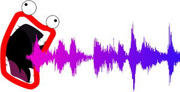

# ShoopDaLoop

ShoopDaLoop is a live looping application for Linux. Under the hood it is "just" an alternative GUI for the tried-and-true [SooperLooper](http://sonosaurus.com/sooperlooper) looper. It is aimed at providing a particular looping workflow:

- **Shiny**: ShoopDaLoop organizes all the information you need into a fixed-size window. You have a full overview of what's going on at all times.
- **Tracks**: ShoopDaLoop presents 48 loops organized into "Tracks" which share a send/return path, similar to [Luppp](http://openavproductions.com/luppp/).
- **Scenes**: Again similarly to [Luppp](http://openavproductions.com/luppp/), there are so-called "Scenes" which select a subset of all loops to be played together. Changing from one scene to another can be used to achieve an impactful musical transition. However, unlike [Luppp](http://openavproductions.com/luppp/)'s scenes, ShoopDaLoop's scenes are not bound to any particular row in the grid. A scene consists of an arbitrary selection of one loop (or none) per track, giving more flexibility.
- **Synchronization**: ShoopDaLoop's loops are all synchronized to the master loop. For example, hitting record on any loop will engage only when the master loop restarts, and recording lenghts are always forced to be an exact multiple of the master loop length.
- **Click tracks**: ShoopDaLoop has a built-in click track generator. Rather than being an "external" metronome, the click track is inserted into one of the loops (usually the master loop).

# Status

ShoopDaLoop works, but not all of its intended functionality is finished yet (see below). GUI elements relating to these features may already be there but not working yet.
Note however that it is in early development. It has not been used for on-stage performing and probably shouldn't until after doing some serious testing.

# Future improvements

- **Live effect chains**: ShoopDaLoop will record both the dry (before send/return) and wet (after processing) signals. During performance, each track can then be set to output either the dry, the recorded wet, or a live-processed wet version. In addition, there will be a mode in which the wet is re-recorded by playing the already recorded dry signal live through the send/return. This way there is lower CPU usage while using the recorded wet, while there is still the possibility to adjust effect settings during playback and re-record the wet version without interruption.
- **Scripted looping**: ShoopDaLoop will have a scripting approach suitable for (semi-)automated scripted looping. The "script" consists of a sequence of actions (e.g.: change scene, mute a loop, start/stop recording on a loop). The sets of actions are executed sequentially, either in a fully automatic or manually triggered way. This way the song structure can be laid out ahead of time.
- **MIDI bindings**: There are none yet. You could experiment with connecting straight to the underlying SooperLooper instance, but this may give some unexpected results since not all possible SooperLooper states are supported by ShoopDaLoop.
- **JACK encapsulation**: To make the connectivity in Jack less confusing, I plan to try to encapsulate the SooperLooper instance and provide JACK ports that match the ShoopDaLoop naming.