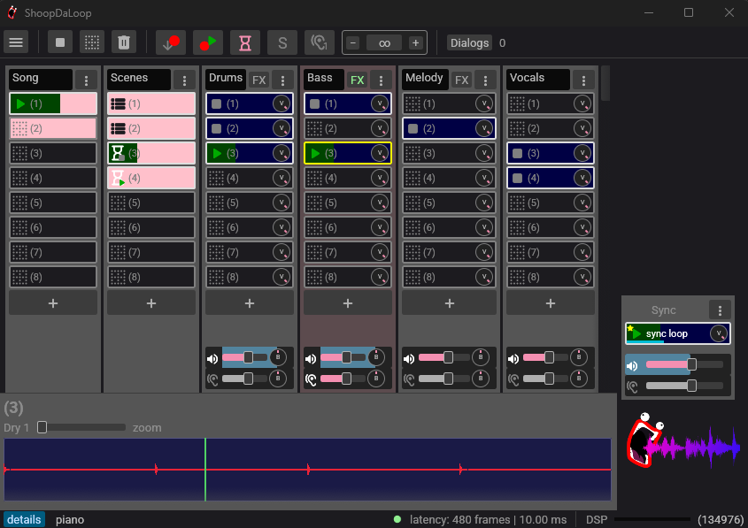

[](https://github.com/SanderVocke/shoopdaloop/actions/workflows/build_and_test.yml)
[](https://github.com/SanderVocke/shoopdaloop/actions/workflows/docs.yml)

# ShoopDaLoop — Limitless Looping

ShoopDaLoop is a playful cross-platform live-looping application for audio and MIDI. It organizes loops into a track grid and supports free-form jamming, controller-driven workflows, and prepared performances.

Releases before 1.0 remain development releases: I wouldn't recommend relying on them in a performance, but if you do, test thoroughly beforehand.

[User and developer documentation](https://sandervocke.github.io/shoopdaloop/) is published from this repository.

## Current features

- Run on any major OS and in the browser. Browser distributions use the hosted bundle so the external built-ins catalog and resource tree remain available.
- Audio and MIDI loops grouped in track columns which share input/output ports.
- A sync loop controls synchronization. Others are multiples of its length.
- Record/play MIDI and/or audio live, through FX/synth racks if desired.
- For tracks with FX/synth racks, you can re-play recorded content through the synth/FX live and e.g. adjust parameters or switch instruments on-the-fly.
- FX/synth options include built-in Carla plugin host integration, externally routed (e.g. external JACK apps/equipment), or a built-in demonstration mini-suite of (bad) synths and effects.
- Audio drivers on desktop are multi-platform based on CPAL + midir, or a dedicated JACK driver for advanced port routing.
- Web Audio/AudioWorklet and Web MIDI in supported browsers.
- Session load/save plus loop audio/MIDI import and export.
- Generated audio or MIDI click tracks.
- Sandboxed Lua scripting for control, with externally packaged keyboard and APC Mini built-ins plus self-contained session-script bundles.

## Screenshot



## Run from source

```sh
# Native application with native FX support.
cargo run -p shoopdaloop

# Native application without Carla hosting.
cargo run -p shoopdaloop --no-default-features
```

For browser development:

```sh
rustup target add wasm32-unknown-unknown
cargo install --locked trunk --version 0.21.14
cd src/rust/shoopdaloop
trunk serve --open
```

See [INSTALL.md](INSTALL.md) for prerequisites and artifact details. The application-specific [technical README](src/rust/shoopdaloop/README.md) documents settings, drivers, browser permissions, files, CI, and verification workflows.

## Builds and platforms

The main workflow builds Linux x86_64, Windows x86_64, macOS arm64, and WebAssembly in debug and release. Native outputs are unsigned application archives. Web outputs include a complete hosted bundle and a core-only single HTML file that explicitly omits the external built-ins tree. Browser media and MIDI access depend on browser support, permissions, secure-context policy, and device availability.

## License and credits

Copyright © Sander Vocke (2023–present) and other credited contributors. See [LICENSE](LICENSE).

ShoopDaLoop is made possible by Rust, egui/eframe, JACK, CPAL, midir, libsndfile-compatible tooling, Carla, omniLua, Tracy, and many other open-source projects represented in `Cargo.lock`. Native archives include the pinned GPL-2.0-or-later Carla runtime and its corresponding-source information.
