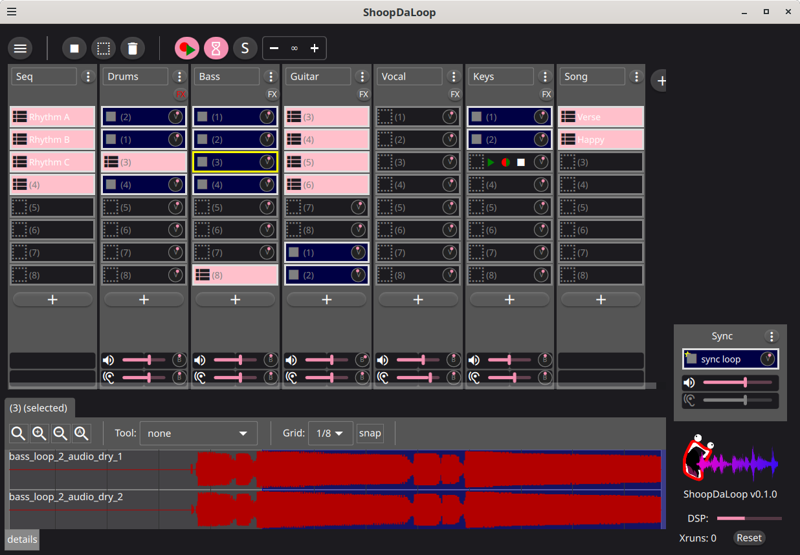

# ShoopDaLoop - Limitless Looping

ShoopDaLoop is an cross-platform advanced live looping application. It offers intuitive looping of audio+MIDI clips in a grid-style layout and some DAW-like features for sequencing.

It is designed for both free-form jamming (solo or together) and pre-scripted looping sessions. Live performance could be a good use-case, although it is not stable enough yet to recommend that at this point.

[Documentation](https://sandervocke.github.io/shoopdaloop/) lives here.

> :warning: **Current releases (<v1.0.0) are development releases. Feel free to give this a test drive, but don't expect a finished product.**

For currently open known issues, check the GitHub Issues page.

# Screenshot

# In a nutshell

- **Fast**: can easily handle a large number of loops.
- **Grid-based**: loops are organized into a grid of tracks, which share inputs/outputs and effects/synthesis.
- **MIDI and audio**: can both be looped, including alongside each other in the same loop.
- **FX/synthesis**: can be inserted into a loop directly (plugins) or via external JACK connections. The same loop can simultaneously record "dry" and "wet" (post-fx) to save precious CPU during playback.
- **Synchronization**: every loop is synced to the "sync loop", which typically holds a beat, click-track or just fixed-length silence. Loops may also be a multiple of the sync loop length.
- **Grabbing**: instead of triggering the recording, you can grab loops retroactively from an always-on recording buffer.
- **Combining**: A powerful system for combining multiple loops into sequences and/or scenes, which can also be controlled as if they were loops.
- **Hackable**: Users can run their own Lua scripts to control the application in new ways.

These features are explained in detail in the [docs](https://sandervocke.github.io/shoopdaloop/).

# Status

ShoopDaLoop is in early development. The basics work but not nearly all of its intended functionality is finished yet (see below).

The intent is for the master branch to always work and pass CI tests, but at the moment, some significant bugs will probably come and go.
Development releases are made now and then, but until a v1.0.0 they are seen as a preview and not expected to be very stable.

As such, it obviously has not been used for on-stage performing and definitely shouldn't until after doing some serious testing.

# Roadmap

The basic features that would be needed for a 1.0.0 release are already there. However, the version won´t go to 1.0.0 until ShoopDaLoop is considered stable for live performing.

The initial architecture combined Python for front-end and as a main entry point with a C++ back-end and QML GUI elements. This works and has enabled a very fast pace of feature development, but also has downsides:

   * in particular Python and PySide can easily cause issues in object lifetimes (garbage collection combined with Qt objects) and performance (the GIL).
   * Debugging crashes is a pain because backtraces always lead through layers of QJSEngine, Qt, PySide, Shiboken and Python.
   * the build is very complicated, using PyPa build with a CMake-wrapping package, with CMake also generating Python wrappers for C interfaces.
   * the C++ back-end has the potential for memory bugs / race conditions because of the multitude of multithreading and shared ownership patterns in use.

Therefore, a process has started to gradually replace both Python and C++ by Rust. Together with Python, the dependency on PySide will also disappear. This will happen in multiple steps:

   * First, port Python code to Rust and remove Python from the codebase altogether. Build system becomes CMake or Cargo. This will be a huge step in the right direction.
   * Then, port C++ code as well and go to a straightforward Cargo build, solidifying the confidence in a correct and robust back-end.

A prerequisite for a 1.0.0 version is that this process is complete and the codebase is only Rust + QML (+ Lua for user scripts).

The downside of this process is that in the process of porting and migrating, the added Rust code will make the build even more complicated.
At the moment there is C++, Python and Rust, and a combination of their respective build tools, with Cargo as a build front-end.

# Comparison table

To summarize why ShoopDaLoop exists and what the goals and plans are, a short comparison table with similar open-source software gives a good picture. Of course, the devil is in the details: the other listed software is great and in many ways different and better. The aim here is not to take away from them in any way.

|                             | ShoopDaLoop                        | SooperLooper     | Luppp                  | Ardour                   |
|-----------------------------|------------------------------------|------------------|------------------------|--------------------------|
| OS                          | Linux, Mac, Windows (2) | Linux, Mac       | Linux                    | Linux, Mac, Windows    |
| MIDI looping                | ✅                                 | ❌              | ❌                       | ✅                      |
| Audio+MIDI co-recording     | ✅                                 | ❌              | ❌                       | ?                      |
| Audio dry+wet co-recording  | ✅                                 | manual setup     | ✅                      | ?                      |
| Loop Organization           | Grid                                | Separate loopers | Grid                     | Grid                   |
| Scenes support              | ✅ (5)                             | ❌              | ✅ (grid row = scene)    | ?                      |
| Designed for live use       | ✅                                 | ✅               | ✅                      | ❌                      |
| Plugin Host                 | ✅ (1)                  | ❌               | ❌                      | ✅                      |
| Song/performance sequencing | ✅ (4)                  | ❌               | ❌                      | ✅ (not sure of details) |
| MIDI controller support     | ✅ (learn / script) (6) | ✅ (MIDI learn)  | ✅ (not sure of method) | ✅ (not sure of method) |
| NSM Session Management      | ✅                                 | ✅               | ✅                      | ✅                      |
| Overdubbing                 | ❌ (planned)                       | ✅               | ✅                      | ?                      |
| Plugin scripts              | ✅ (3)                  | ❌               | ❌                      | ✅                     |
| Transport/tempo system      | None (trigger on sync loop)        | None             | JACK transport / MIDI beats | ? |

(1): ShoopDaLoop has built-in support to host Carla through LV2, relying on Carla as a proxy to support other plugin types such as VST(3). 
(2): Windows and Mac work, although the only supported back-end is JACK audio, which is non-standard on Windows / Mac.  
(3): ShoopDaLoop plug-in scripts are written in LUA. Currently the main goal is to support deep MIDI controller integrations and custom keyboard control scripts and opening/managing additional MIDI control ports. Future goals could be integration with the future song/performance sequencer or integration with the outside world by e.g. network. 
(4): ShooDaLoop supports "composite loops", allowing you to combine sequences of loops into other loops hierarchically. Through this method, complex sequences and simple songs can be constructed. 
(5): See (4): composite loops can be used as scenes. 
(6): Currently this can be used to control ShoopDaLoop. Mapping to plugin parameters is planned for the future.

Disclaimers:

- I may have mistakes in this table due to not being completely familiar with these programs. Please raise an issue/PR for corrections or extra products to compare.
- Also note that I filled this in primarily as a comparison of FOSS loopers for Linux. Software like Ardour offers way more other DAW functionality that neither ShoopDaLoop nor the other loopers have.

As seen in the comparison table, ShoopDaLoop is closest to Luppp in what it offers, the main differentiators being built-in MIDI support and the planned features for song construction. And of course, the details of how loops are managed exactly differ between all these tools and are a matter of preference.

# Installation

See the Releases page and [INSTALL](INSTALL.md) for details.

# License / Copyright

Other than Git submodules and files which explicitly mention a different copyright owner, copyright owner for all files in this repo is Sander Vocke (2023).
For copying, see LICENSE.txt.

# Credits

This project is only made possible due to many libraries and tools, including but not limited to:

   - Rust;
   - Qt;
   - cxx-qt;
   - libsndfile;
   - JACK audio;
   - numpy;
   - scipy;
   - boost::ut;
   - qoverage, coverage for QML / Python code coverage, resp.;
   - many others (see submodules and dependencies)
