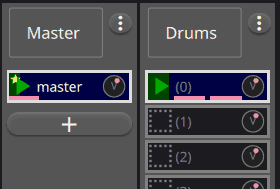
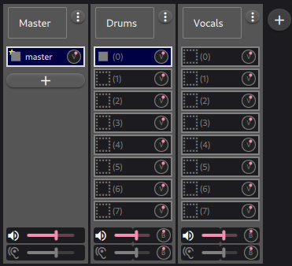

Concept
=======================================

Master Loop
------------

In **ShoopDaLoop**, the **master loop** plays an important role in looping. Any new project starts with an empty **master loop**.

Actions on **loops** are synchronized to **triggers** of the **master loop**. A **trigger** is emitted when the **master loop** restarts. Examples:

* A requested **transition** (e.g. to recording, playing or stopped mode) will *usually* happen on the **master loop**'s next **trigger**.
* When a loop finishes playing, it will restart on the next **trigger** (which is usually instantly, as loops are typically multiples of the **master loop**'s length).

The master loop may itself hold audio and/or MIDI data. A typical use is a click track. However, it is also perfectly fine to leave it empty and use it for synchronization only.

   Synchronization to the master loop.

Tracks
-------

   Example of three tracks in ShoopDaLoop.

**ShoopDaLoop**'s loops are divided over **tracks**. Loops in the same **track** share their input/output port connections, gain/balance and effects/synthesis. Therefore, typically a track per instrument/part is used.

Composition and Sequencing
--------------------------

Any loop slot in **ShoopDaLoop** can be used as a **composite loop**. That means the loop wraps a combination of other loops. Use-cases:

* As a **scene**: trigger multiple loops to play together.
* As a **sequence**: trigger multiple loops to play one after the other (e.g. to represent a verse / chorus).
* Combine them hierarchically to create entire **songs**.
* **Planned recording**: recording into a composite loop automatically records into all its children - e.g. to record an entire track while each part of what you play gets stored in the correct sub-loop.

Effects / Synthesis
---------------------

   Signal flow when using internal FX/Synthesis in plugins.

   Signal flow when using external FX/Synthesis.

**ShoopDaLoop** supports two track port connection modes: **regular** and **dry/wet**.

In **regular** mode, there is simply an input and an output.

In **dry/wet** mode, an effects and/or synthesis chain can be inserted for the track. When recording loops, the dry and wet signals are simultaneously recorded. This enables tricks such as re-playing the dry loop through live effects, playing back the wet while disabling the effects for CPU savings and re-synthesizing with different virtual instruments.

Note that the **dry** channel can be MIDI, audio or both. However, the **wet** channel can only be audio.

**Dry/wet** mode can be configured in two ways: using external JACK **send** and **return** ports or hosting plugins directly inside **ShoopDaLoop** via **Carla**. 

There are advantages to using plugins if possible:

* Dry, fx/synthesis and wet are all processed in a single audio process iteration. This saves one period of latency w.r.t. external, where the back-end will usually take two cycles to pass the signal back into ShoopDaLoop and out again.
* Internal plugin state can be remembered by ShoopDaLoop and saved with the session. With external FX/synthesis this would only be possible with e.g. NSM.