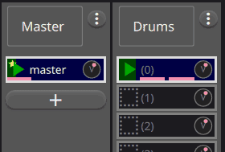

Concepts
========

Sync loop
---------

Every session has one **sync loop**. Synchronized loop transitions occur when
that loop restarts; immediate mode applies transitions without waiting. The
sync loop may contain audio or MIDI, but it can also be silent and serve only
as the timing reference.

The global record-cycle value controls fixed-length recording and retroactive
grab duration. A value of zero means recording continues until another action
stops it.

Tracks and loops
----------------

Loops are arranged in track columns. Loops in one track share ports, input and
output controls, monitoring, and an optional processor. The separate sync track
is the timing reference for the main grid.

Regular tracks route audio and optional MIDI directly. **Dry + Wet** tracks can
record the source and processed audio together. Their dry recording can later
be played through the shared processor or used to replace the wet recording.

Processing
----------

Native builds support external processing, Built-in FX powered by `FunDSP
<https://github.com/SamiPerttu/fundsp>`_, Built-in Synth powered by OxiSynth,
and Carla Rack/Patchbay modes when native FX support is enabled. Browser builds
support both built-ins in the AudioWorklet. Built-in FX is a matching-channel
mono/stereo/N rack with Compressor, Drive, three-band EQ, Chorus, Modulation,
and Reverb stages. Its required MIDI input and the global FX-control fan-out can
apply learned absolute CC mappings to continuous controls; notes are ignored.
Disabled stages do not run their effect DSP. Available choices are
capability-driven, so a session requiring an unavailable processor is rejected
rather than loaded partially.

Connections
-----------

The Connections window shows compatible application and host audio/MIDI ports.
Native host ports come from JACK or CPAL+midir. Browser host ports come from
Web Audio and permission-gated Web MIDI. Connection state is explicit and is
kept separate from pending changes.

Recording and grabbing
----------------------

Normal recording starts prospectively. **Grab** captures recently monitored
input from bounded always-on buffers, aligned to the sync or targeted loop.
Selection applies actions to groups of loops; targeting lets one loop act as an
alternate synchronization source.
