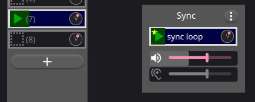

Concept
=======================================

Sync Loop
------------

In **ShoopDaLoop**, the **sync loop** plays an important role in looping. Any new project starts with an empty **sync loop**.

Actions on **loops** are synchronized to **triggers** of the **sync loop**. A **trigger** is emitted when the **sync loop** restarts. Examples:

* A requested **transition** (e.g. to recording, playing or stopped mode) will *usually* happen on the **sync loop**'s next **trigger**.
* When a loop finishes playing, it will restart on the next **trigger** (which is usually instantly, as loops are typically multiples of the **sync loop**'s length).

The sync loop may itself hold audio and/or MIDI data. A typical use is a click track. However, it is also perfectly fine to leave it empty and use it for synchronization only.

   Synchronization to the sync loop (note the picture needs updating, as at the time it was called "master loop").

Tracks
-------

.. figure:: resources/tracks.png
   :width: 300px
   :alt: tracks in ShoopDaLoop

   Example of three tracks in ShoopDaLoop.

**ShoopDaLoop**'s loops are divided over **tracks**. Loops in the same **track** share their input/output port connections, gain/balance and effects/synthesis. Therefore, typically a track per instrument/part is used.

Composition and Sequencing
--------------------------

Any loop slot in **ShoopDaLoop** can be used as a **composite loop**. This is **ShoopDaLoop**'s way of providing concepts that may be familiar from other software, including:

* **scenes**;
* **sequences** and **songs**;
* **pre-scripted** recording and looping.

For more information, see :ref:`Composite Loops <composite_loops>`.

Effects / Synthesis
---------------------

   Signal flow when using internal FX/Synthesis in plugins.

.. figure:: resources/external_fx.drawio.svg
   :width: 800px
   :alt: FX / Synthesis using external program.

   Signal flow when using external FX/Synthesis.

**ShoopDaLoop** supports two track port connection modes: **regular** and **dry/wet**.

In **regular** mode, there is simply an input and an output.

In **dry/wet** mode, an effects and/or synthesis chain can be inserted for the track. When recording loops, the dry and wet signals are simultaneously recorded. This enables tricks such as re-playing the dry loop through live effects, playing back the wet while disabling the effects for CPU savings and re-synthesizing with different virtual instruments.

Note that the **dry** channel can be MIDI, audio or both. However, the **wet** channel can only be audio.

**Dry/wet** mode can be configured in two ways: using external JACK **send** and **return** ports or hosting plugins directly inside **ShoopDaLoop** via **Carla**. 

There are advantages to using plugins if possible:

* Dry, fx/synthesis and wet are all processed in a single audio process iteration. This saves one period of latency w.r.t. external, where the back-end will usually take two cycles to pass the signal back into ShoopDaLoop and out again.
* Internal plugin state can be remembered by ShoopDaLoop and saved with the session. With external FX/synthesis this would only be possible with e.g. NSM.