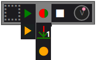

Controlling Loops
-----------------

Loops in ShoopDaLoop can be controlled by mouse, keyboard or MIDI controllers. There are also several **global controls** that affect each command given to a loop.

Global Controls
^^^^^^^^^^^^^^^^

   The global controls bar.

The global controls, from left to right, are: **menu**, **stop all**, **sync mode**, **solo mode**, **auto-play recorded**, **clear all** and **record cycles**. Hovering over these buttons shows their function in a tooltip.
Some of these are *togglbable*. These can be clicked to toggle them, and also have a keyboard mapping to momentarily invert them.

Some details:

* **sync mode**: *togglable* (``Ctrl`` key). Affects the timing of loop triggers. If sync is not active (exclamation symbol), loop triggers such as play, stop, record execute immediately. If sync is active (hourglass symbol), such commands happen at the first upcoming restart of the **sync loop**.
* **solo mode**: *togglable* (``Shift`` key). If active (highlighted), commands such as play and record will stop all other loops in the same track(s).
* **auto-play recorded**: *togglable* (``Alt`` key). If active (highlighted), the default trigger after recording a loop is to play it back. That includes the behavior when doing a default trigger on a loop (spacebar / MIDI controller), but also affects what happens after triggering a fixed-length recording (playback or stop). It also affects the **grab** button (explained below).
* **record cycles**: Numeric control. Change by typing or pressing the number keys on the keyboard. Setting to 0 sets it to *infinite*. This affects recording commands. If set to *infinite*, triggering a recording will record the loop until another trigger is given. However, if set to a specific number, the recording will last N sync loop cycles before going to playback/stop. This also affects the **grab** button (explained below).

Loop Controls
^^^^^^^^^^^^^

   The loop controls as seen when hovering over a loop with the mouse.

The icon in the left-hand side of a loop displays its current state. It is also an area where you can grab and drag the loop to another location, or right-click it to open a context menu. The rest of the icons shown here appear when hovered with the mouse.

Loops support several kinds of triggers. **play** (green), **record** (red, rendered partly green if **auto-play recorded** is active) and **stop** do what you would expect. Note that playback is always looping once started. Also note that by default, playback happens from the *wet* recording for **dry/wet tracks**, meaning that the audio recorded from the FX/synth output is played back.

There is an individual **volume dial** for the loop playback, as well as a **balance dial** for stereo loops (appears when hovered over the volume dial).

The orange variants of the **play** and **record** commands are present for loops on **dry/wet tracks**, and are referred to as **play dry** and **re-record dry**:

* **play dry** is equivalent to **play**, except that instead if playing back the *wet* recording, we play back the *dry* recording through the synth/FX. That means you can tweak the instrument/effects and hear the result. Be aware that all loops in the same track share a single FX/synth, so using **play dry** on multiple loops simultaneously may give unexpected-sounding results because the dry signals will merge together - especially when using MIDI signals.
* **re-record dry** is meant for when you have changed the FX/synth settings, and want to re-record your *wet* recording to make it permanent. When clicked, the loop will play back its *dry* signal through the track's FX/synth, and simultaneously record the *wet* signal. When played back once, it will stop or playback again.

Finally, there is the **grab** button (downward-pointing arrow, partly green if **auto-play recorded** is active). This is explained below.

Grabbing (always-on recording)
^^^^^^^^^^^^^^^^^^^^^^^^^^^^^^

Having to manually trigger recordings ahead of time can cost focus and break your flow. It also gets annoying when you make a mistake while recording - you have to re-trigger the recording again. Alternatively, "grabbing" means to instantly capture a recording in hindsight. It is made possible because ShoopDaLoop is always recording in the background. Usin this is the most intuitive way to record in most cases: you don't have to prepare or trigger anything for recording. Instead, just play, and once you are satisfied with what you played, grab it into a loop.

The main thing to get used to with grabbing is that you need to instruct ShoopDaLoop:

* how many cycles to grab;
* how many cycles ago did the recording of interest start.

For this, the global controls are used:

* By default, if **sync mode** is on and **record cycles** is 1 or "infinite", a single sync loop cycle's worth of data will be grabbed, and it will be the part that was played during the *most recently completed* sync loop. In other words, if you play something, wait for the sync loop to restart, and then grab, what you played is captured. Note that if **auto-play recorded** is active, it will also start playing immediately when grabbed.
* Changing **record cycles** affects the grabbed amount of cycles. The alignment is still such that the last grabbed cycle aligns with the last completed sync loop cycle.
* When **sync mode** is off (immediate), the behavior slightly changes. The currently playing sync loop cycle will be included in the grab. Because the cycle is not yet finished, the loop will also immediately go into "record" mode to record the remainder, and then automatically go to playback/stop afterward. This is useful if you want the playback to start seamlessly - after all, when grabbing in hindsight, you only hear the playback after grabbing.
* Grabbing works nicely together with **loop targeting**. If you have targeted another loop (details below), grab will behave as if that loop was the sync loop. In other words: if you target a loop that is playing back, play a second part together with it, and then grab afterward, your recording will line up with the targeted loop.

Selecting and Targeting
^^^^^^^^^^^^^^^^^^^^^^^^^

Loops can be **selected** (yellow border) by clicking their icon next to the buttons on the left-hand side. Selection is useful for triggering multiple loops together. Performing a transition on any loop will also perform the same transition on all currently selected loops. The selection can be moved by the keyboard keys. Multiple loops can be selected by holding the ``Ctrl`` button and clicking more loops or pressing arrow keys.

A single loop can be **targeted** (orange border) by double-clicking it or pressing ``T``. The behavior of certain loop transitions is different if another loop is currently targeted. Generally speaking, the idea of targeting is: *let ShoopDaLoop pretend that loop is the sync loop*. So most actions/triggers will sync to the restart of the targeted loop. This is particularly useful if you want to record multiple parts that are more than 1 cycle long - you don't have to think about how many cycles to record, or when to trigger exactly.

Pre-recording
^^^^^^^^^^^^^^^

Oftentimes, a catchy hook or riff will start before the "1" of the music. Or, the loop starts on 1 but you want to start it will e.g. a small fill the first time. This makes it complicated to loop sometimes, because you would need to anticipate one sync loop cycle earlier than the actual looping part starts, and also start playback earlier.

For this reason, loops in **ShoopDaLoop** are already **pre-recording** in the before the real recording starts. You normally won't notice this because the data for this part is stored but usually never played. Also when **grabbing**, additional cycles of data are stored before the "actually grabbed" part, so that pre-recording data is available.

To hear the pre-recorded part back, you need to enable **pre-playback**. This is done in the loop details window (opened from the loop context menu when right-clicking it). There, you can define a "pre-play range". The way this behaves is that when a loop is stopped, and playback is triggered, the pre-play range will play back *before* the loop playback starts. In other words, your drum fill going into the loop will be heard. When the loop is already playing back, the pre-play part is *not* played again on every cycle - only the first time.

MIDI looping
^^^^^^^^^^^^

In principle, MIDI loops work the same as audio loops. However, playing back a MIDI signal will not always result in the exact same sound as the first recording, because:

* The audio synthesis (in plugin or external JACK application) may have internal state that is not directly controlled by MIDI;
* MIDI has a state, which includes all CC values, pitch bend, notes already active at recording start, etc.

The way ShoopDaLoop approaches MIDI playback is to approximate the state at the start of recording as closely as possible. That means:

* ShoopDaLoop will restore states like CCs (including sustain pedal, mod wheel, pitch) to the state they were in when recording started, at the start of every playback loop.
* If a note was already active when recording started, ShoopDaLoop will remember this and play the same note at the start of every playback loop. One advantage of this is if a note was played just slightly before recording start, it will sound indistinguishable in most cases. Note that this does not in include notes that are finished (on + off) just before recording start.

Composite Loops
^^^^^^^^^^^^^^^

A **composite loop** can be created by selecting an empty slot, then holding **Alt** and clicking another loop. The other loop is added to the composite loop composition:

* Normally at the end of the current sequence. Note that the same loop may also be clicked multiple times to add it repeatedly.
* If **Ctrl** is also held, it is added in parallel of the current sequence.

Note that **Alt** + click will append to the first "timeline". So for example, if a short loop is composed in parallel with a long one, **Alt** - click will add an additional loop to play right after the short one.

For advanced editing of the sequence, the loop details window should be used (note that at the time of writing this, that is unimplemented).

Composite loops are shown in pink; if a composite loop is (solely) selected, all its sub-loops are highlighted with a pink border.

..
    TODO: pictures

Playback
""""""""

Playing back a composite loop will play the loops as sequenced. Empty sub-loops are skipped. The progress indicator on the composite loop shows the total progress. The playback will cycle back around to the start of the sequence.

Recording
"""""""""

In order to record a composite loop, the sub-loops must already have contents so their lengths can be determined. That means you will first need to record the subloops separately or manually set their lenghts.

When this is the case, pressing "record" on the composite loop will re-record the subloops in sequence.

Note that there is a special case if the same subloop is sequenced multiple times. It will not re-record multiple times. Instead, after re-recording it the first time, additional occurrences in the sequence are skipped with the subloop idle.