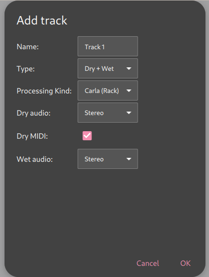

Controlling Tracks
--------------------

Volume Controls
^^^^^^^^^^^^^^^^^^^^^^^^^

**ShoopDaLoop** tracks have two volume controls:

* The **input volume** governs volume of the track's input ports. All incoming signals are attenuated by this volume. This means it affects both monitoring and recording.
* The **output volume** governs volume of the track's output ports. All outgoing signals are attenuated by this volume. This means it affects both monitoring and playback.

Both volume controls come with:

* A **balance knob** if the in-/outputs are stereo for this track.
* A **mute button** to mute the track's in-/outputs. For the input this differs from the volume slider in that it only affects monitoring, not recording.

Track Configuration
^^^^^^^^^^^^^^^^^^^^

When a new track is added using the **add track button**, you are presented with the **Add Track Dialog**:

The available settings are:

* **Name**: the display name of the track. Also determines the base name of the track's ports, which won't be renamed if the track is renamed.
* **Type**: the type of track. Two options are available:

  * **Direct**: Direct looping. Audio/MIDI inputs are routed to the loops, and loops are routed to Audio/MIDI outputs.
  * **Dry/Wet**: Dry/Wet looping. Audio/MIDI inputs are routed to the dry loop, and the dry loop is routed to the wet loop. The wet loop is routed to the Audio/MIDI outputs.

* **Processing Kind**: Only applicable to dry/wet loops. Determines the signal path from dry to wet. There are several options:

  * **External (JACK)**: Create additional ports such that an external FX/synth chain can be connected. It is up to the user to connect an external application from the **send** to the **return** ports.
  * **Carla (Rack)**: Host FX/synth internally in **Carla** as a plugin. Carla is run in **Rack** mode (straightforward FX chain).
  * **Carla (Patchbay)**: Host FX/synth internally in **Carla** as a plugin. Carla is run in **Patchbay** mode (processing graph).

* **(dry/wet/direct) Audio**: Number of audio channels for the track's loops.
* **(dry/direct) MIDI**: Whether to enable a MIDI channel. For direct tracks, this will loop MIDI with a MIDI output. For Dry/Wet tracks, MIDI is only supported on the dry side (the expectation being that the FX to wet includes some kind of synthesis to audio).

Port Connections
^^^^^^^^^^^^^^^^^

Connections to a track's ports can be managed using the **Connections Dialog**. It can be found under the track settings menu dropdown (**Connections...**).