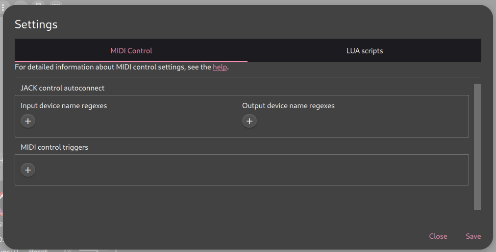
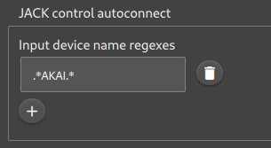
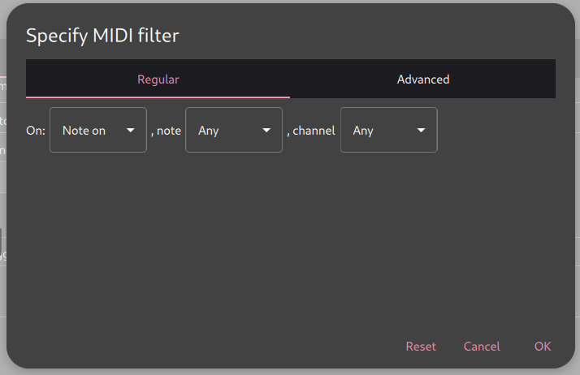
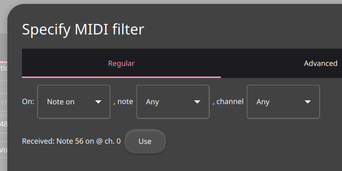

MIDI Controllers
----------------

**ShoopDaLoop** can be controlled by MIDI signals. This can be done either through the user configuration or by writing advanced integration scripts in Lua. The former is described here - for the latter, see :ref:`Lua scripting <lua_scripting>`.

To configure MIDI settings, open the Settings dialog and go to the **MIDI Control** tab:

Autoconnect
^^^^^^^^^^^

In most cases, you will want **ShoopDaLoop** to connect automatically to your controller via the **JACK** patchbay. To do this, enter a regular expression for your device name into the respective autoconnect regex field:

Save your configuration and try it out. When connecting your device, **ShoopDaLoop** should automatically connect to it.

MIDI control rules
^^^^^^^^^^^^^^^^^^

MIDI controllers are set up as a list of **rules**. A rule defines a filter that selects incoming MIDI messages, possibly a condition, and an action to execute. Rules can be simple mappings of messages to actions, up to advanced rules where filters and actions may both incorporate snippets of Lua code.

Example 1: Simple mapping using MIDI Learn
""""""""""""""""""""""""""""""""""""""""""

In this example we want to map an incoming note to perform the default action on any selected loop(s).

First, ensure your device is automatically or manually connected to **ShoopDaLoop**'s **control** MIDI port.

Next, click the "+" to add a new MIDI trigger. A filter dialog greets you:

Here we configure the filter selecting our incoming MIDI message which will trigger our action. Rather than choosing the filter manually, press a button on your MIDI controller. A notification should appear of what was just received:

Click "Use" to use the received message as a filter. If you wish, you may modify the filter (such as making it independent of channel by setting the channel to Any). Press OK to accept the trigger.

A new trigger has been added to the list. From the "Do:" dropdown, choose "Default Loop Action". Leave the newly appeared "loops" input set to "selection".

Save your configuration and test it out: Close the settings window, use the mouse or keyboard to select a loop (it will light up yellow) and press the same button on your MIDI controller. It should now (try to) transition to Recording.

Example 2: Advanced note-to-loop mapping
""""""""""""""""""""""""""""""""""""""""

Some midi controllers have row(s) or grid(s) of buttons that can be used to trigger loops. In that case it is cumbersome to set up individual rules for every button.

Instead, we can use a single rule that maps the incoming note to the loop number. This can be done by using a Lua expression in the filter.

As in example 1, set up your device so it is connected and open the filter dialog for a new trigger rule. Try out a few buttons on your controller and note down the note number received. You will need to work out the formula that calculates the **ShoopDaLoop** loop coordinates (row, column) from the note number. In our example, let's assume we
worked out that the row will be the note divided by 8, and the column will be the remainder.

Again, let's choose the Default Loop Action, but now, for the "loops" input, choose "custom":

